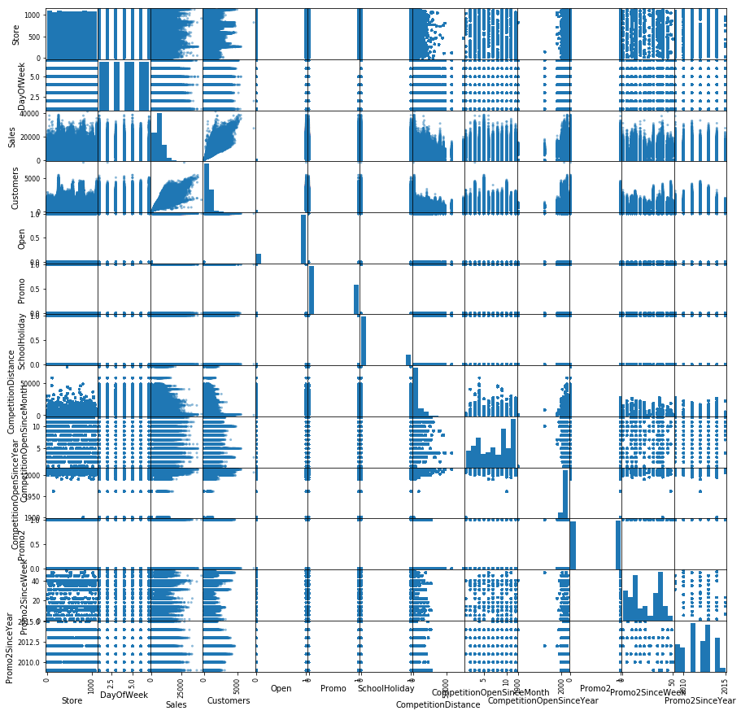
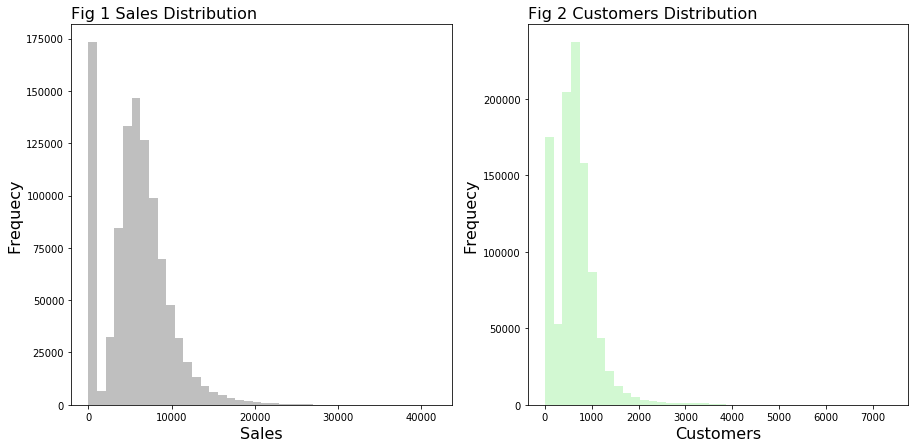
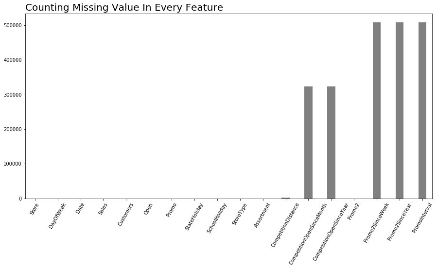
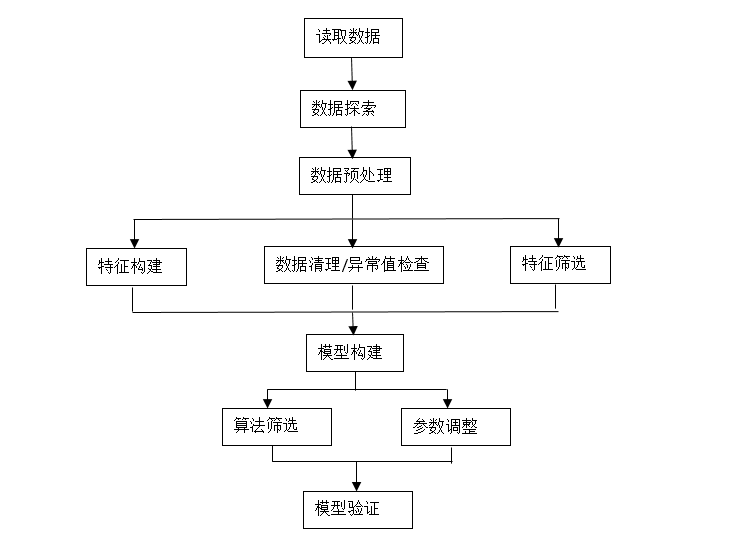

**目录**

[toc]

## MLND 

### 毕业开题报告
作者：RayZen
日期：2018 年 5 月 27 日

### 项目背景
`Rossmann` 是经营了超过 `3,000` 家遍布欧洲 `7` 个国家的公司。现在 `Rossmann` 经营者希望能够预测六周的每日销售情况，而它的销售情况收到多个因素影响，例如：促销、竞争对手、学校和国家节假日、季节性因素以及本地化等因素等的影响。因为根据每家店的管理者根据当地的实际情况进行了销售预测，预测结果的准确度差异太大${^{[1]}}$。

本次项目，`Rossmann` 的管理者希望能够通过提高预测的准确性来帮助他们更有效的做出工作计划，以及同时达到提高效率和机动性。对此，提出了需要增强预测的 **稳定性**。

机器学习，主要是通过相应的数据来学习确认一种现实世界的模式，或者不用显式编程和构建模型的方式来进行预测。典型的被分为监督式学习和非监督式学习${^{[2,3]}}$。其中监督式学习根据有“标签”的数据进行学习，通过得到的数据模型应用于通过输入数据获得结果（另外根据不同的输入数据或者特殊的反馈方式，又被分为**半监督式学习**、**增强式学习**等）；另外非监督式学习是通过无“标签”数据进行学习，以其找到数据中的结构信息以备其他学习方式使用。另外在实际应用场景下，监督式学习主要是回归和分类两种方式；而非监督式学习的应用包括聚类、推荐系统等方面。

### 问题描述
根据 `Rossmann` 经营者提出的要求，构建模型以提高预测接下来的六周准确的稳健性。也就是说需要对经营额进行预测，这是一个连续性数据；`data` 是具有 `label` 的数据${^{[1]}}$。从对数据初步探索可以，该数据集包括了 2013 年 1 月 1 日至 2015 年 7 月 31 日共计大约两年半的数据集，从下图可知：

解决这个问题的方式，是从监督式学习中的回归方式来解决这个问题。因此此项目的重点是增强预测的稳定性，以到达可以对实际经营情况进行稳定预测的目的。

### 数据探索
本次项目中的文件列表如下：

* `train.csv`：具有 `label` 的历史销售数据，需要用于训练构建模型
* `test.csv`：无 `label` 的历史销售数据，需要用于测试训练的模型
* `sample_submission.csv`：提交的预测数据的正确格式样本文件
* `store.csv`：补充的 `Rossmann` 经营的 `1115` 家商店的信息

而在本次项目中需要的数据的 `features` 信息如下：

|Feature Name|Description|More Information|
|:-----------:|:---------|:---------------|
|Store|每家商店的独一编号|
|Sales|给定的每天的销售额|
|Customers|给定的每天的消费者数量|
|Open|指示说明商店是否营业|`0`=`closed`;`1`=`open`|
|StateHoliday|指示说明国家法定节假日|`a`=`public holiday`;`b`=`Easter holiday`;`c`=`Christmas`;`0`=`None`|
|SchoolHoliday|说明商店是否都受到学校关闭的影响|
|StoreType|说明商店的类型|`a`,`b`,`c`,`d`|
|Assortment|说明商店的差异经营策略的类型|`a`=`basic`,`b`=`extra`,`c`=`extended`|
|CompetitionDistance|最近竞争者的距离|
|CompetitionOpenSicne|最近竞争者的开始营业时期|`CompetitionOpenSicneMonth`=开始经营月份;`CompetitionOpenSicneYear`=开始经营年|
|Promo|说明给定日期时商店是否有进行促销|
|Promo2|说明商店是否有进行连续的促销活动|`0`=`store is not participating`;`1`=`store is participating`|
|Promo2Since|描述了开始参与连续性促销的日期|`Promo2SinceWeek`=参与促销的月份;`Promo2SinceYear`=参与促销的年份|
|PromoInterval|描述有连续性促销的间隔|哪些月份有连续性促销|

从以上的 `features` 描述和应当使用的数据类型来看，某些数据是连续性数值数据，例如：`Sales`,`Customers`,`CompetitionDistance`；离散型二分类数据，以 `0` 和 `1` 的数值来表达一些特殊性信息，例如：`Open`, `Promo`,`Promo2`,`SchoolHoliday`；离散型多分类数据，通过不同的字符表示不同信息，例如：`StateHoliday`,`StoreType`,`Assortment`；序列型数据，主要为序号以及日期类型数据；另外有一类是文本描述类数据，例如:`PromoInterval`。对现有 `features` 进行绘图，如下：

其中对 `Sales`,`Customers` 进行分析，可知两者是偏态分布的，数据分布详情详情如下：

本数据集中总共可以使用的 `features` 数量为 `18`，而数据量为 `1,017,209` 条记录。对各 `features` 的缺失值情况进行分析，发现在 `CompetitionDistance`、`CompetitionOpenSinceMonth`、`CompetitionOpenSinceYear`、`Promo2SinceWeek`、`Promo2SinceYear` 以及 `PromoInterval`。从缺失情况来看，数据的整洁性较高——因为以上的 `features` 缺失具有一定的合理性。对 `Promo2` 进行分析，发现其值在为 `0` 时的数量为 `508,031` ，和`Promo2SinceWeek`、`Promo2SinceYear` 以及 `PromoInterval` 三者的数量一致。

### 解决方法描述
从前面的数据初步探索和 `features` 特点来看，该数据集中有大量的 `category data`。因此在进行了异常值探寻之后，在特征工程的阶段需要对数据的 `features` 要进行筛选以及重新构造以筛选出可用的 `features`。而 `features` 的构建依据前人进行的探索${^{[4, 5]}}$，以及实际情况，一方面需要从日期的角度进行新的构建；另一方面，考虑到数据量足够大，对分类型数据需要尝试新的编码，以可构建可用的 `features`。在完成以上步骤之后，需要筛选出合适的 `features` 才能进行进行模型构建。模型构建方面，根据 `Kaggle` 目前已有的优异探索结果来看，使用了 `XGBoost`。在进行尝试阶段，还是优先尝试 `XGBoost`，之后还需要进行其他尝试。

### 评估标准

**基准模型选择**
在基准模型选择方面，可以从几个方面进行考虑：1）从已有的模型中进行选择，这个需要进行先构建一个模型；2）依照实际数据集的数据进行评价，这需要依据每个类型的对象数据值——平均值或者中位数进行对照。但是因为该数据集是一个时间序列的数据集，存在其他潜在因素因素影响，所以不适用直接使用对象数据值来进行评估；3）参考已经完成的一定数据量的模型得分。

综合以上特点判断，决定选择使用第三种方式作为模型基准，即以 `kaggle` 竞赛中的前 `10%` 作为基准——得到的测试评分为 `0.11773`。

**评估指标**
根据项目发起人的要求，项目最终评价指标是使用`RMSPE`(即：`Root Mean Square Percentage Error`)${^{[1,6]}}$，其计算公式如下：

$$
{RMSPE=\sqrt{\frac{1}{n}\Sigma_{i=1}^{n}(\frac{y_i-\hat{y_i}}{y_i})^2}}
$$

### 项目流程
整体的项目流程如下：

### 参考

1. [Rossmann Store Sales.](https://www.kaggle.com/c/rossmann-store-sales)
2. [Machine learning .](https://en.wikipedia.org/wiki/Machine_learning)
3. [Machine Learning for Humans.](https://medium.com/machine-learning-for-humans/why-machine-learning-matters-6164faf1df12)
4. [A Journey through Rossmann Stores
](https://www.kaggleusercontent.com/kf/106951/eyJhbGciOiJkaXIiLCJlbmMiOiJBMTI4Q0JDLUhTMjU2In0..Waj-Z1GxxIgh23xsbs4Ngg.f9nJJwNdjWqHqoz5u864wMEFCjrp273ZBgf-Xranw1DHHK--MnhX4RV661nPEOBR9zdTjhMN4SiFJ7DevEmFq31QxKl7l-xOdYw-aDiM7MGjwocGMKsc1G8dMnUxw6BEuH19F-L22iBnEPC8zmo485Uxz1eeRMogdY8AjO58qhs.h6ejXSs2vKEPhxgtivBn9A/output.html)
5. [Rossmann Exploratory Analysis](https://www.kaggleusercontent.com/kf/124149/eyJhbGciOiJkaXIiLCJlbmMiOiJBMTI4Q0JDLUhTMjU2In0.._fhhtixYhS4PxlWDXvVKfQ.sIgrnBLygm4AHX58Kw-2zBIdDTvbSS8YleTFWFSOXDV7_FnARDpIhGMax9TeFadYq-W9InNhlYV94S5SzIkV7NiQR_hA6aaJk7WOGqcbdU3Ng4tXxnzC_g4a4pyHPd5Z69zLBtOmiInL6DREtH7X6Q.aU-WTP6xkcqTsmJ8vIk4dA/output.html)
6. [Scoring Measures for Prediction Problems](http://faculty.smu.edu/tfomby/eco5385_eco6380/lecture/Scoring%20Measures%20for%20Prediction%20Problems.pdf)
