**目录**

[TOC]


## MLND

### 毕业报告

作者：RayZen

日期：2018 年 8 月 14 日


## $\rm I$. 问题的定义

### 1.1 项目概述

`Rossmann` 是经营了超过 `3,000` 家遍布欧洲 `7` 个国家的公司。现在 `Rossmann` 经营者希望能够预测六周的每日销售情况，而它的销售情况收到多个因素影响，例如：促销、竞争对手、学校和国家节假日、季节性因素以及本地化等因素等的影响。因为根据每家店的管理者根据当地的实际情况进行了销售预测，预测结果的准确度差异太大。

本次项目，`Rossmann` 的管理者希望能够通过提高预测的准确性来帮助他们更有效的做出工作计划，以及同时达到提高效率和机动性。该项目需要解决的问题是 **营业额预测问题**，同时需要保障增强预测的 **稳定性**。从对数据初步探索可以，该数据集包括了 2013 年 1 月 1 日至 2015 年 7 月 31 日共计大约两年半的数据集，从下图可知：

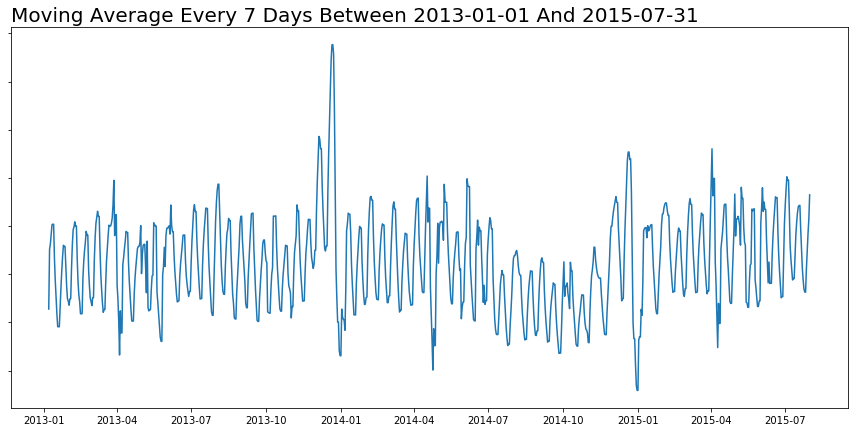

### 1.2 问题陈述

本项目中提供的训练数据集由 `train.csv` 提供销售数据信息，`store.csv` 提供营业的商店信息（其中营业时期范围为 2013 年 1 月 1 日至 2015 年 7 月 31 日）。首先需要将两个数据文件进行整合为一个训练数据集。经验证，该数据集是一个具有 17 个 `features` 和 1 个 `label`，而且该 `label` 是一个连续型数据。那么也就证实了，在本项目中需要通过 **监督式学习** 来完成对项目分析。

其次，在完成数据的基本探索分析后，需要对数据的某些 `feature` 的数据进行重新构建以及筛选。因为在本数据集的 `features` 大部分都是类别型数据，一方面需要将相关数据进行转换，用以表达相关信息；另一方面，初步探索中已经知道该数据是同时是一个时间序列类型数据，对这类数据在进行数据信息转换的同时需要考虑到时间分析的连续性，可能随机性不适用于该数据类型。

最终的数据结果是能够获得稳定性高的预测测试数据的结果。另一方面，考虑到实际应用层面，希望最终的模型是可以被实际应用到现实中的场景中。例如，将该模型用到 `Rossmann` 的商店营业额预测，以帮助它们建立有效的工作计划，提到工作生产效率和机动性。

综合以上分析以及前人对该问题的分析，本次项目将采用 `XGBoost` 来建模解决 **营业额预测的回归** 分析。

### 1.3 评价指标

1. 在基准模型选择方面，可以从几个方面进行考虑：1）从已有的模型中进行选择，这个需要进行先构建一个模型；2）依照实际数据集的数据进行评价，这需要依据每个类型的对象数据值——平均值或者中位数进行对照。但是因为该数据集是一个时间序列的数据集，存在其他潜在因素因素影响，所以不适用直接使用对象数据值来进行评估；3）参考已经完成的一定数据量的模型得分。综合以上特点判断，决定选择使用第三种方式作为模型基准，即以 `kaggle` 竞赛中的前 `10%` 作为基准——得到的测试评分为 `0.11773`。

2. 根据项目发起人的要求，项目最终评价指标是使用`RMSPE`(即：`Root Mean Square Percentage Error`)，其计算公式如下：
   $$
   \rm RMSPE=\sqrt{\frac{1}{n}\sum_{i=1}^{n}(\frac{y_i-\hat{y}_i}{y_i})^2}
   $$
   该指标和另一个常用的评估指标 `MPE`相比， 一方面避免了因方向和绝对大小，导致评估范围过大和计算误导。使用 `RMSPE` 的优势在时间序列上能够比较真实的变化比例，同时也能计算出平均的百分比变化。


## $\rm II.$ 分析

### 2.1 数据探索

#### 2.1.1 数据描述

本次项目中的文件列表如下：

- `train.csv`：具有 `label` 的历史销售数据，需要用于训练构建模型
- `test.csv`：无 `label` 的历史销售数据，需要用于测试训练的模型
- `sample_submission.csv`：提交的预测数据的正确格式样本文件
- `store.csv`：补充的 `Rossmann` 经营的 `1115` 家商店的信息

而在本次项目中需要的数据的 `features` 信息如下：

|     Feature Name     | Description                      | More Information                                             |
| :------------------: | :------------------------------- | :----------------------------------------------------------- |
|        Store         | 每家商店的独一编号               |                                                              |
|        Sales         | 给定的每天的销售额               |                                                              |
|      Customers       | 给定的每天的消费者数量           |                                                              |
|         Open         | 指示说明商店是否营业             | `0`=`closed`;`1`=`open`                                      |
|     StateHoliday     | 指示说明国家法定节假日           | `a`=`public holiday`;`b`=`Easter holiday`;`c`=`Christmas`;`0`=`None` |
|    SchoolHoliday     | 说明商店是否都受到学校关闭的影响 |                                                              |
|      StoreType       | 说明商店的类型                   | `a`,`b`,`c`,`d`                                              |
|      Assortment      | 说明商店的差异经营策略的类型     | `a`=`basic`,`b`=`extra`,`c`=`extended`                       |
| CompetitionDistance  | 最近竞争者的距离                 |                                                              |
| CompetitionOpenSicne | 最近竞争者的开始营业时期         | `CompetitionOpenSicneMonth`=开始经营月份;`CompetitionOpenSicneYear`=开始经营年 |
|        Promo         | 说明给定日期时商店是否有进行促销 |                                                              |
|        Promo2        | 说明商店是否有进行连续的促销活动 | `0`=`store is not participating`;`1`=`store is participating` |
|     Promo2Since      | 描述了开始参与连续性促销的日期   | `Promo2SinceWeek`=参与促销的月份;`Promo2SinceYear`=参与促销的年份 |
|    PromoInterval     | 描述有连续性促销的间隔           | 哪些月份有连续性促销                                         |


#### 2.1.2 异常值探索

1. 在对数据分析之前，需要将所有需要的数据 `store` 和 `train` 进行整合为一个 `data` 数据集。首先对 `Sales` 和 `Customers` 数据进行异常值分析，从 `Boxplot` 可以看出这两个 `features` 中存在极端值，根据情况需要删除极大值点。

    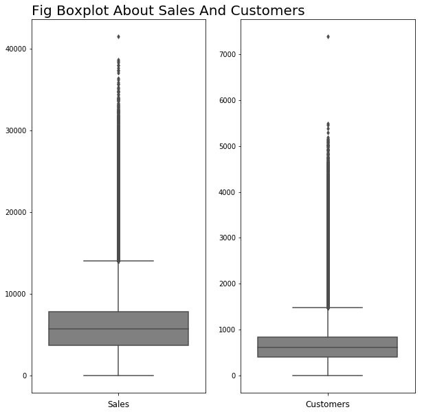

2. 对 `Sales` 和 `Open` 数据进行探索，发现存在没有营业且销售额为 0 的数据点，有 17287 个数据点占总数居点大约 `10%` 的数据。这样的数据对后期模型建立过程中，可能导致过高偏差。因此对这类数据进行删除。


#### 2.1.3 缺失值探索

1. 对数据集的进行缺失值分析, 竞争者距离中有三个缺失值，对数据的分布探索，它是一个正偏态分布。在保证数据的合理性的情况下，可以采用中位数对缺失值进行填充
    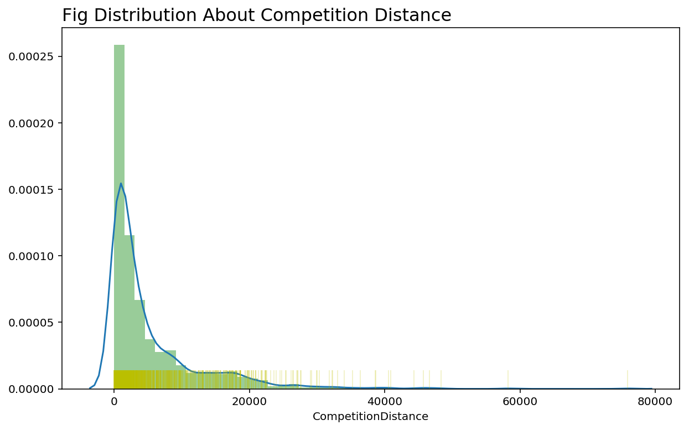
2. 此外数据集中存在，另外两个竞争者的年份和月份存在缺失值，综合经验和实际假定这两个的缺失值可以使用 **中位数** 进行填充


#### 2.1.4 数据转换

1. 通过连续日期的年份，发生的周数以及假设是在周一开始促销，获得商店连续促销可能的起始日期
2. `store` 数据集中 `PromoInterval` 的数据是一个字符串包裹的月份信息，可以将其相关信息进行拆分以方便后续分析。其唯一信息如下：1）`Jan`,`Apr`,`Jul`,`Oct`；2）`Feb`,`May`,`Aug`,`Nov`；3）`Mar`,`Jun`,`Sept`,`Dec`
3. 营业数据集 `train` 中，为了方便分析需要对营业日期数据进行转化，提取出年份、月份数据
4. 计算出每天中各门店平均每个顾客销售额
5. 计算出连续促销和距离最近的竞争者开始营业月份数
6. 对发生了连续促销的日期以及营业日期比较，转换出发生了连续促销的时间
7. 对 `Sales` 和 `Customers` 进行对数转换，将数据转换为一个近似正太分布的数据


#### 2.1.5 分类数据处理

对数据集中类别型变量进行处理，这类 `features` 主要包括：`StoreType`， `Assortment`, `StateHoliday`，分别需要转换为特定的类型数据。


### 2.2 数据分析


#### 2.2.1 销售额和客户数量关系探索

首先对 `Sales` 和 `Customers` 数据进行探索，使用散点图的方式和统计学分析的方式来对两者的相关性进行分析。首先对两者进行散点图展示，可以看出两者还是有相关性。因此通过统计学模型（其中使用 `OLS` 模型）进行分析，计算出两者的相关性结果。

散点图展示：
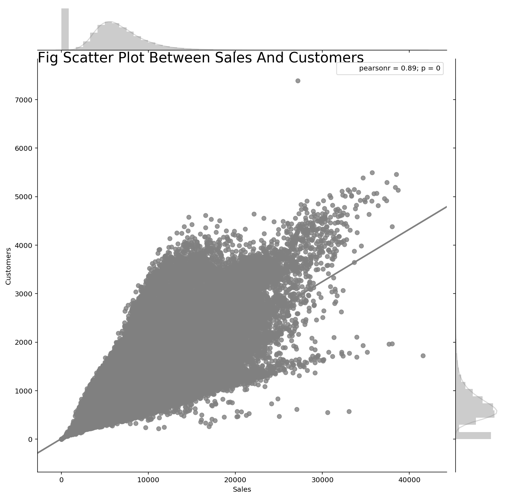


相关性分析报告：

```markdown
                   Results: Ordinary least squares
======================================================================
Model:              OLS              Adj. R-squared:     0.930
Dependent Variable: Sales            AIC:                18173504.6382
Date:               2018-06-13 17:20 BIC:                18173516.4707
No. Observations:   1017208          Log-Likelihood:     -9.0868e+06
Df Model:           1                F-statistic:        1.355e+07
Df Residuals:       1017207          Prob (F-statistic): 0.00
R-squared:          0.930            Scale:              3.3625e+06
------------------------------------------------------------------------
                Coef.    Std.Err.       t       P>|t|    [0.025   0.975]
------------------------------------------------------------------------
Customers       8.5237     0.0023   3681.1981   0.0000   8.5192   8.5283
----------------------------------------------------------------------
Omnibus:             481000.264     Durbin-Watson:        1.714
Prob(Omnibus):       0.000          Jarque-Bera (JB):     12544512.549
Skew:                -1.724         Prob(JB):             0.000
Kurtosis:            19.855         Condition No.:        1
======================================================================
```
从分析结果可以看出，两者具有相关性具有显著性，并且 $R^2=0.930$，具有强相关性


#### 2.2.2 每周销售额和客户数量分析

自 2013 年至 2015 年每周平均销售额度和平均客户数量分析可以得出以下结论：

1. 在星期天来商店购物的人数明显偏少，同时营业额也是偏少
2. 在星期一、星期二以及星期五购物的人数和营业额是较高的，其中在星期一的营业额和客户数量最高
3. 对星期天营业商店进行计数统计，其中关闭的商店占了绝大多数。因此因为营业状态的差异，在进行平均值计算的时候出现不符合实际情况

在每年中每周平均销售额度：

在每年中每周平均客户数量：

在每年星期天中商店营业与否统计表格：

|        | 2013  | 2014  | 2015  |
| :----: | :---: | :---: | :---- |
| Closed | 56584 | 51925 | 32628 |
|  Open  | 1396  | 1375  | 822   |


#### 2.2.3 每月销售额和客户数量分析

自 2013 年至 2015 年每月平均销售额度和平均客户数量分析可以得出以下结论：

1. 每月同比统计平均销售额和平均用户数量，随着年份增加，该额度也整体表现增高的趋势
2. 年度平均销售额度和平均用户数量最高月份是在 11 月份和 12 月份，其次是在 6 月份和 7 月份，以及 3 月份

每月平均销售额在每年中变化：
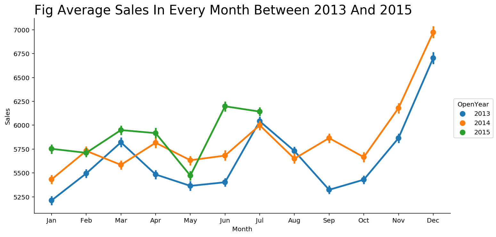

每月平均用户数量在每年中变化：
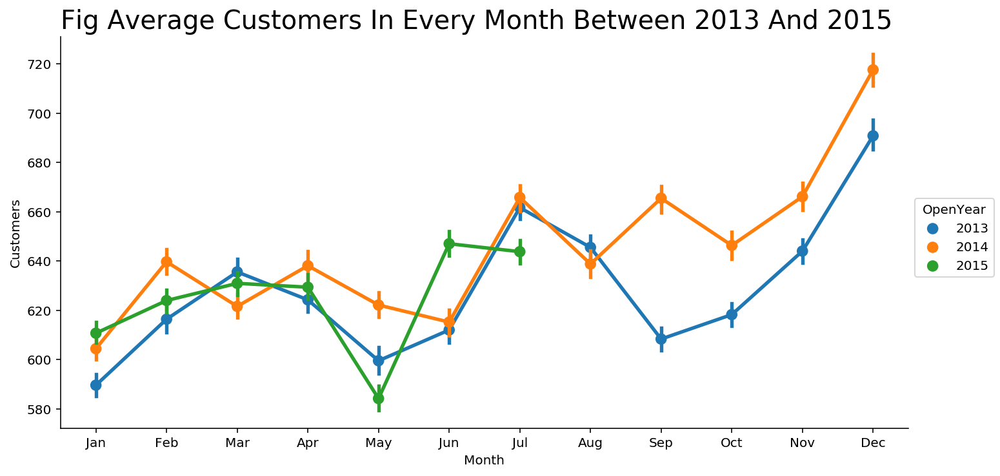


#### 2.2.4 促销对每月销售额度和客户数量影响分析

自 2013 年至 2015 年，是否有进行促销活动对每月平均销售额度和平均客户数量影响分析可以得出以下结论:促销对月平均销售额和平均客户数量，都有正面的影响。即促销活动促进了销售额和用户数量的增加；在 12 月份中影响表现极其明显，这可能是因为不仅是促销的影响

促销对平均销售额度的影响：
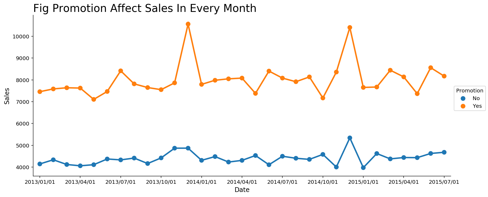

促销对平均用户数量的影响：
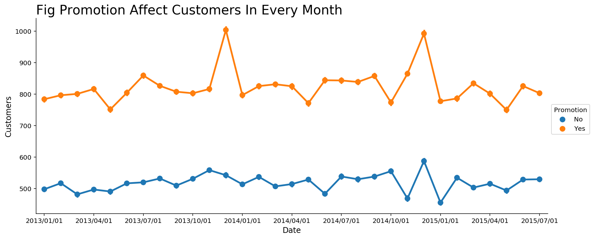


#### 2.2.5 商店类型和商店经营策略影响分析

1. 四种商店类型中, B 类商店的平均营业额是最高的，同时光顾的客户数量也是最多的。这样可能会导致单位客户销售额的平均值降低，最后从单位客户销售额的分析中体现了出来。对 B 类商店的客户猜测，他们主要是购买小宗药品以及不是集中购买
2. 其他三类商店的每月的平均营业额差异不大，另外在光顾商店的客户数量差异也不是很大
3. 分析每月中单位客户销售额的平均值来看，A 类商店是最高的，其次是 D 类，反而在 B 类商店是最低的
4. 商店经营策略差异方面，对 B 类商店影响比较大，其中采用 `extended` 方式经营的 B 类商店每月平均客户数量和平均销售额是最高的。对其他类型的商店，对平局客户数量和平均销售额影响不明显

不同商店类型和经营策略的商店每月平均销售额对比：


不同商店类型和经营策略的商店每月平均客户数量对比：


不同商店类型和经营策略的商店每月单位客户销售额的对比：

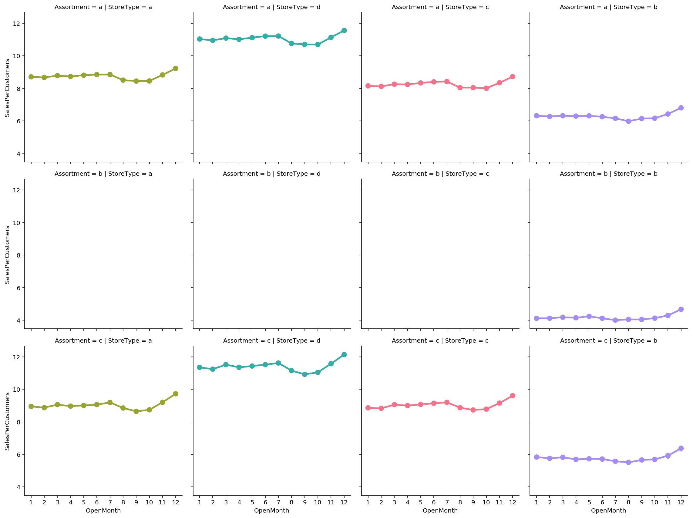


#### 2.2.6 对基本 `features` 信息进行相关性分析

对部分 `features` 进行相关性分析，建立热力图：

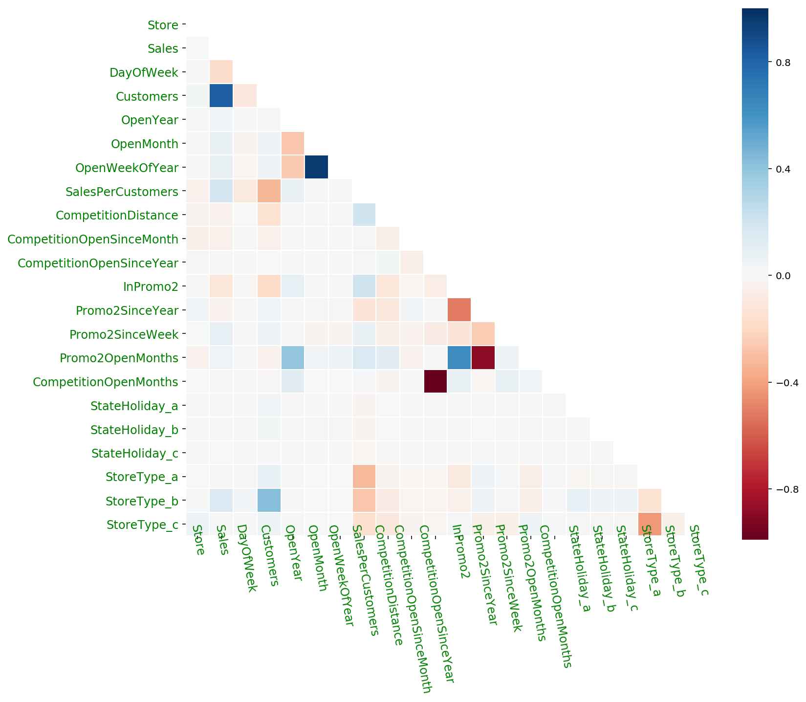

其中存在强相关性的 `feature`，例如 `Sales`, `Customers`, `OpenWeekOfYear`, `OpenMonth`等营业周期和销售额度，客户数量；在 `StoreType_b`,`Sales`, `Customers` 等商店类型和销售额度，客户数量之间，存在强相关性；`Promo2OpenMonths`,`Promo2SinceYear`, `InPromo2` 等关于连续促销之间存在，强相关性。


### 2.3 算法和技术

从早期的数据探索和 `features` 、`label` 特点来看，该问题的解决需要从回归的角度来入手。考虑到模型最终需要稳健性，也就是说在模型要求减少方差；此外，结合对数据探索，发现其中有大量的 `category data`，综合考虑使用 `ensemble learning`。从 `kaggle` 目前的算法结果来看，使用 `XGBoost` 方法获得较好的结果。确认在模型的算法上，使用 `XGBoost` 进行模型构建。

首先集成算法上，不同于基于数据得到的单一假设，它通过迭代的方式能够获得一个假设集合并使用一个相应的策略进行组合应用——这样得到的泛化能力比简单的单一模型要更强，因为它能够将多个弱学习器。其中在生成个体学习器中，其中使用了一个方式是梯度提升（**Gradient Boosting**），它是通过串行方式生成个体学习器。其中主要的学习流程是$^{[1]}$：

1. 假设输入的训练集 $D=\{(x_1, y_1), (x_2, y_2),...,(x_m, y_m) \}$，差异化损失函数 $L(y, F(x))$，此外确认了迭代次数为 $M$

2. 算法的第一步是需要使用一个常数值来初始化模型：

3. 迭代 $M$ 次，分别需要计算：

   1. 需要计算出伪残差(**pseudo-residuals**)

      

   2. 拟合基学习器 $h_m(x)$ 的伪残差，这里需要使用使用训练数据集 $\{(x_i, r_{im}) \}_{i=1}^n$

   3. 通过下式来计算出乘数：

      

4. 更新最终的模型：$F_{m}(x)=F_{m-1}(x)+\gamma_mh_m(x)$

模型构建方面，根据 `Kaggle` 目前已有的探索结果来看， `XGBoost` 取得了非常优秀的结果。本次模型中将使用 `XGBoost` ，它可以用于回归问题和分类问题，原理是依据通过将多个弱分类器组合，同时结合了梯度下降的算法来最小化损失以提高准确率。而且它具有计算速度快，模型表现好的特点——这在目前的 `kaggle` 竞赛结果中已有体现。在构建目标函数中，引入了惩罚项$\Omega$ 来度量模型复杂度，最终的目标函数等式是 $Obj(\Theta)=L(\Theta)+\Omega(\Theta)$。模型最终通过损失函数和惩罚项来平衡偏差和方法，同时引入了一阶和二阶导数的 **泰勒展开式** 来训练损失函数，此外在基学习器中可以选择使用 gbtree 的树或者 gblinear 的线性分类器，以此建立一个稳定良好的模型。

`XGBoost` ，它也是依赖于**决策树融合**，因此在调试参数的时候需要从树深度、学习率等角度进行调试参数$^{[3]}$。


### 2.4 基准模型

在基准模型选择方面，可以从几个方面进行考虑：1）从已有的模型中进行选择，这个需要进行先构建一个模型；2）依照实际数据集的数据进行评价，这需要依据每个类型的对象数据值——平均值或者中位数进行对照。但是因为该数据集是一个时间序列的数据集，存在其他潜在因素因素影响，所以不适用直接使用对象数据值来进行评估；3）参考已经完成的一定数据量的模型得分。

综合以上特点判断，同时目前已经确认的 `kaggle` 分数结果，决定选择使用第三种方式作为模型基准，即以 `kaggle` 竞赛中的前 `10%` 作为基准——得到的测试评分为 `0.11773`。


`XGBoost` 是基于 `GB`，即 `Gradient Boosting`，这种算法不仅可以用于分类问题，同时还能用于解决回归问题。

因此在进行了异常值探寻之后，在特征工程的阶段需要对数据的 `features` 要进行筛选以及重新构造以筛选出可用的 `features`。而 `features` 的构建依据前人进行的探索，以及实际情况，一方面需要从日期的角度进行新的构建；另一方面，考虑到数据量足够大，对分类型数据需要尝试新的编码，以可构建可用的 `features`。在完成以上步骤之后，需要筛选出合适的 `features` 才能进行进行模型构建。在进行尝试阶段，还是优先尝试 `XGBoost`，之后还需要进行其他尝试。

`XGBoost` 是基于 `Gradient Boosting Decision Tree` 的算法，它不仅可以被用于解决分类问题还有可以解决回归问题。在算法上，它依据通过将多个弱分类器组合，同时结合了梯度下降的算法来最小化损失以提高准确率。而且它具有计算速度快，模型表现好的特点——这在目前的 `kaggle` 竞赛结果中已有体现。

## $\rm III.$ 方法


### 3.1 数据预处理

#### 3.1.1 异常值处理

在进行数据探索中，确定了销售额和客户数量的异常值的数据点信息。其中 `Sales` 的极值索引行信息如下：

```markdown
Store                                        909
DayOfWeek                                      1
Date                         2015-06-22 00:00:00
Sales                                      41551
Customers                                   1721
Open                                           1
Promo                                          0
StateHoliday                                   0
SchoolHoliday                                  0
StoreType                                      a
Assortment                                     c
CompetitionDistance                         1680
CompetitionOpenSinceMonth                    NaN
CompetitionOpenSinceYear                     NaN
Promo2                                         1
Promo2SinceWeek                               45
Promo2SinceYear                             2009
PromoInterval                    Feb,May,Aug,Nov
CompetitionOpenDate                          NaT
Name: 44393, dtype: object
```

 `Customers` 的极值索引行信息如下：

```markdown
Store                                        817
DayOfWeek                                      2
Date                         2013-01-22 00:00:00
Sales                                      27190
Customers                                   7388
Open                                           1
Promo                                          1
StateHoliday                                   0
SchoolHoliday                                  0
StoreType                                      a
Assortment                                     a
CompetitionDistance                          140
CompetitionOpenSinceMonth                      3
CompetitionOpenSinceYear                    2006
Promo2                                         0
Promo2SinceWeek                              NaN
Promo2SinceYear                              NaN
PromoInterval                                NaN
CompetitionOpenDate          2006-03-01 00:00:00
Name: 993496, dtype: object
```

根据各行的信息判断，`Sales` 的极值并非因为节假日或者促销等原因导致的，所以对这个极值需要进行删除；而 `Customers` 中，因为有促销活动而导致了消费者数量增加，这个事件具有合理性。因此最终删除 `Sales` 的极值行信息。


#### 3.1.2 缺失值处理

1. 在 `store.csv` 数据集中有存在关于竞争者信息，例如竞争者距离存在三个缺失值。根据实际情况判断以及对数据的分布探索——数据是一个正偏态分布。为了保证数据的合理性的情况下，可以采用中位数对缺失值进行填充。同时对竞争者的开始营业信息采取中位数处理的方式，进行填充。
2. 在商店的营业信息分析中，发现存在门店营业状态缺失但是有营业额产生的情况。结合这种情况对营业数据中的营业状态值设置为 1。
3. 对于在数据集中销售额为 0，且未营业的门店进行清理


#### 3.1.3 分类数据处理及虚拟变量

数据集中商店类型、经营策略、节假日类型以及星期数，这几个数据的数据类型为分类数据。为了方便后续的数据处理，将数据类型转换为合适的数值信息进行表达。

1. 商店类型		对 `StoreType` 使用虚拟变量，分别创建了 4 种商店类型的变量，并且最终只保留了 **StoreType_a**、**StoreType_b**、**StoreType_c** 等三个变量
2. 经营策略        对 `Assortment` 使用虚拟变量，分别创建了 3 种经营策略类型的变量，并且最终只保留了 **Assortment_a**、**Assortment_b** 等两个变量
3. 节假日类型   在对 `StateHoliday` 使用虚拟变量之前，将数据中的值转换替换为了对应的节假日信息。之后分别创建 4 中节假日类型的变量，并且在最终保留了 **StateHoliday_Public**、**StateHoliday_Easter**、**StateHoliday_Christmas** 等三个变量
4. 星期数        对 `DayOfWeek` 使用虚拟变量，分别创建了 7 个关于当前日期的星期数，并且最终只保留了 **DayOfWeek_1**、**DayOfWeek_2**、**DayOfWeek_3**、**DayOfWeek_4**、**DayOfWeek_5**、**DayOfWeek_6**


#### 3.1.4 数据转换

为了将数据转换为有用的信息，另一方面也为了方便数据处理，对某些变量进行了相应的处理。

1. 对数据集中的 `Date` 进行解析，分别提取出当日的营业年份、月份、每月的第几天、每年的第几天以及每年的第几周。最终创建了新的变量 **OpenYear**、**OpenMonth**、**OpenDayOfMonth**、**OpenWeekOfYear** 以及 **OpenDayOfYear**
2. 为了解析是否进行了连续促销，将进行 `Promo2SinceYear`，`Promo2SinceWeek` 解析为开始连续促销的日期。之后综合分析商店营业的日期、开始连续促销的日期、是否属于连续促销的周期以及是否有进行连续促销进行分析，将有进行连续促销的商店数据转换为 **InPromo2**
3. 将竞争对手的自开始营业的日期，结合当前营业的日期，将数据转换了 **CompetitionOpenMonths**
4. 将每家商店的平均营业额、平均客户量、单位客户的平均消费额以及客户中位数等相关信息，转换为相应的数据，创建了变量 **AvgSales**，**AvgCustomers**，**AvgSalesPerCustomers**，**MedianCustomers**
5. 根据各家商店的营业年份，所属年份的周数来计算出本周学校的假期数、下周假期数以及上周假期数，分别创建了变量 **HolidayThisWeek**，**HolidayNextWeek**，**HolidayLastWeek**
6. 同样根据各家商店的营业年份，所属年份的月数来计算出本月的法定节日假期数、下月法定节假日期数以及上月法定节假日假期书，分别创建了变量 **StateHolidayNextMonth**，**StateHolidayThisMonth**，**StateHolidayLastMonth**
7. 根据各家商店所属周期的营业额和客户量，来计算出营业的商店各周内每天分别的平均销售额、中位数销售额、平均客户量以及中位数客户量，分别创建了变量 **AvgSalesInDayOfWeek**，**MedianSalesInDayOfWeek**，**AvgCustsInOpenDayOfWeek**，**MedianCustsInOpenDayOfWeek**
8. 同样根据各家商店所属营业的月份的营业额和客户量，来计算出营业的商店每月的中位数销售额、平均客户量以及中位数客户量，分别创建了变量 **AvgSalesInOpenMonth**，**MedianSalesInOpenMonth**，**AvgCustsInOpenMonth**，**MedianCustsInOpenmonth**
9. 另外销售额的分布是一个偏态分布，为了方便后续模型训练和减少误差，使用了对数转换的方式得到两者数据 **SalesByLog**


### 3.2 执行过程


#### 3.2.1 数据拆分与模型测试

在项目中，因为是时间序列的分析，调整了最初方案使用 `train_test_split` 来分割数据，使用了**最后几周时间间隔数据作为验证数据集**，而时间间隔上使用了测试数据集同等的间隔。

首先将所有的特征进行训练以此来确认可用的重要特征。此过程中使用的 `XGBoost` 的参数如下：

```python
param = {"max_depth":5,
        "eta":0.03,
        "silent":1,
        "objective":"reg:linear",
        "booster": "gbtree",
        }
```

最后得到关于特征重要性分析结果如下：

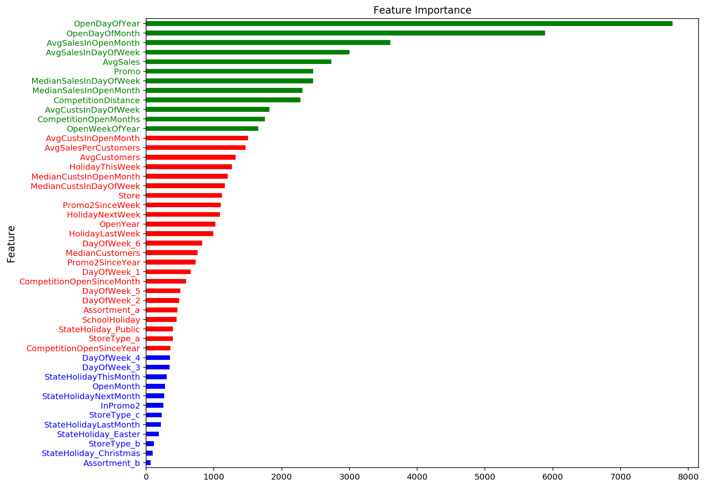

并且将得到的预测结果，上传至 `kaggle` 进行结果检验。最终得到的结果如下：

| Private Score | Public Score |
| ------------- | ------------ |
| 0.15080       | 0.12126      |


#### 3.2.2 特征选择和模型调参

根据上面特征重要性分析结果，选择重要性得分在前 25% 的特征作为基本特征（绿色部分）；此外还从后 50% 特征（红色部分）中选择了前 10 个特征作为补充特征。这样最终构建了训练数据中的特征。

在本次的模型中，首先调参从属性模型的角度来考虑调整 `max_depth`，`subsample`， `colsample_bytree` $^{[3, 4]}$；为了获得更多可能的弱学习器，考虑调整 `eta`； `num_round` 和 `early_stopping_rounds` 用于控制迭代循环；此外为了调整惩罚项，增加了 `lambda` 参数。


### 3.3 完善

经过前面的选择，确认了训练数据的特征以及需要调整的参数方案。经过多轮循环组合参数的方式，来训练模型。最终得到了一个较优异的模型：

```python
params = {"objective": "reg:linear",
          "booster": "gbtree",
          "eta": 0.01,
          "max_depth": 14,
          "min_child_weight": 6,
          "subsample": 0.6,
          "colsample_bytree": 0.4,
          "silent": 1,
          "lambda": 0.1,
          "seed": 1301}
```

在本地得到的训练下，结果如下：

| Train RMSPE | Eval RMSPE |
| ----------- | ---------- |
| 0.006689    | 0.012486   |

最终将得到的结果上传进行验证：

| Private Score | Public Score |
| ------------- | ------------ |
| 0.11629       | 0.10743      |


## $\rm IV.$ 结果


### 4.1 模型的评价和验证

从最初确认的模型到最终确认的模型，进行在线评估中得分明显得到了极大的提升。在模型构建过程中，采用了不同方式来对数据进行预处理；特征选择方面，依据了初始模型的特征重要性得分进行分析；基准模型的，直接使用了已有排名得分进行评估。

之后就是对模型参数调整，依据决策树为基础信息调整了模型的最大深度，子样本占整个样本集合的比例，特征采样比例。还有考虑学习器构建过程中需要参考到的学习率，迭代次数以及提前终止循环次数。最后还增加了对 `L2` 正则惩罚系数以降低过拟合。


### 4.2 合理性分析

从最初建立的模型到最终确立的模型来看，两次的 `RMSPE` 得分值都偏小，也就是满足了项目在设定之初对稳健性的要求。虽然没有达到最初在基准模型上要求的 `0.11773`，但是最终得 Private Score 是 `0.11629` ，这已经达到了最终的要求。


## $\rm V.$ 项目结论


### 5.1 结果可视化

对结果可视化的展示，使用的数据为验证数据集。展示的结果主要从几个方面来阐释：1）每家商店实际销售额和预测销售额的差异百分比的平均值和标准差；2）从日期的角度来分析每家商店的实际销售额和预测销售额的差异百分比的平均值和标准差

首先对每家商店的实际销售和预测销售额的差异百分比进行分析：

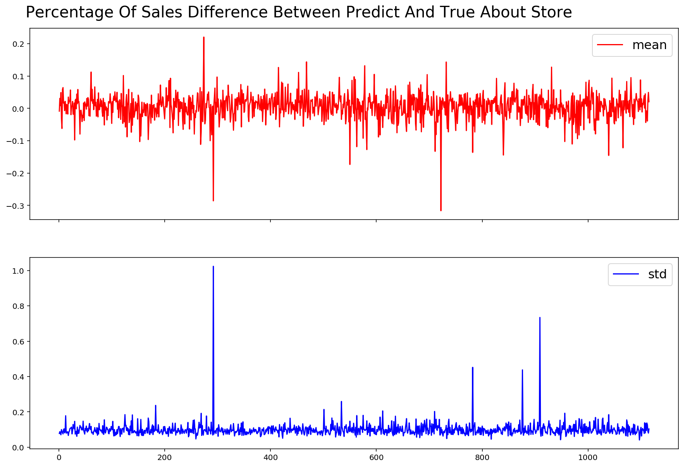

接下来是对不同营业日期中实际销售额和预测销售额的差异百分比进行分析：


从以上的结果来看，如果对商店整体的预测值和实际值之间差异进行分析，对于某些商店的预测稳定性和预测的效果整体还是比较高的，但是在某些商店上面还是缺乏稳定性。从日期的角度来分析商店的预测值和实际值之间差异，日期角度的波动性要小一些，但是波动范围却要也相对更小一些。整体的分析不论是稳定性还是预测的效果，从整体的日期来来看都是比较好一些的。

在以上的商店的差异值中，存在最大差异值。为了深入了解连续六周的预测稳定性，以及最大差异值具体的分布情况。从数据中确认了差异值的均值和标准差最大的商店，是 274 和 292。因此对这两家商店的最后六周实际销售额和预测销售额的差异。

下图为 274 号商店的销售额比较：

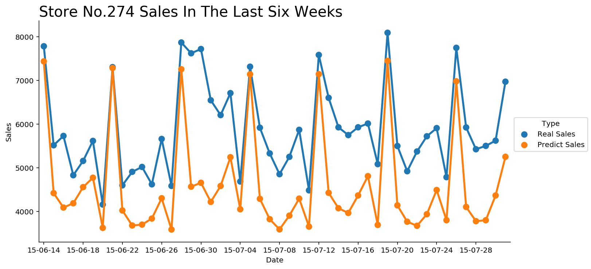

下图是 292 号商店的销售额比较：

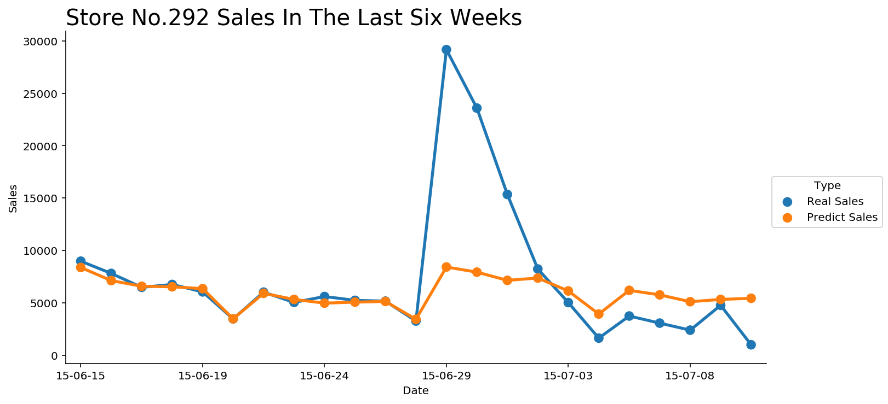

从上面的结果可以看出整体的预测上，准确性以及稳定性都是比较高的，即使是在平均值最大的 274 号商店中得到的差异稳定行也是比较高的，而 294 号商店是因为中间三个日期的差异加大而导致整体的稳定性不是很好，但是整体上来看模型基本上满足了稳定性的要求。


### 5.2 对项目的思考

本次机器学习的项目流程，基本上都是依据了一般流程：


在整个过程中，因必要的数据探索和数据清理花费了部分时间，特别是数据探索中进行了不同角度的分析方式，发现了一些对商店类型和经营类型差异的影响。另外就是对于特征的构建和选择过程花费了大量时间，借鉴了已有的经验建立了一些特征，同时建立了新的特征。最后耗费大量时间是进行参数调整，因为在本地进行同时仪器限制耗费了很多时间。

项目过程中遇到的困难还是多方面，一是对 `XGBoost` 的模型理解，它是整个项目基础从理解它的算法到参数选项都进行不断地尝试和学习。对数据的理解是一个方面，特别是在特征选择过程中参考了特征重要得分、特征相关性，但是两者之间没有融汇贯通还是难以进行深度分析。另外就是最终主要还是依赖于参数调整，来达到最终的项目要求。

从项目的结果来看，虽然达到了项目要求，但是因为该项目中使用的是高相关度单模型进行模型训练，所以直接使用模型融合的方式不是优化方式。后期可以尝试使用多种特征训练，得到相关度不高的模型结果之后可以考虑尝试进行模型融合。


### 5.3 需要做出的改进

首先来说，该结果并没有发挥出融合模型的优势，在结果上太依赖于调试参数来得到结果。另外整个项目耗时太长，同时缺乏其他方式或者算法的尝试。目前的思考可以从以下角度进行改进：

1. 特征挖掘 以目前的状态来考虑，项目中还有尚未发掘出特征选择的优势
2. 其他 `boosting` 模型，例如 CART，lightGBM
3. 在深度学习的角度来解决该问题，目前已经有前人使用 `Entity Embedding` 的方式来进行预测分析。并且取得非常良好的结果


## $\rm VI.$参考

1. [Gradient boosting](https://en.wikipedia.org/wiki/Gradient_boosting).
2. [Introduction to Boosted Trees ](https://xgboost.readthedocs.io/en/latest/tutorials/model.html).
3. [Python API Reference](https://xgboost.readthedocs.io/en/latest/python/python_api.html).
4. [机器学习系列(12)_XGBoost参数调优完全指南（附Python代码）](https://blog.csdn.net/han_xiaoyang/article/details/52665396)
5. [A Journey through Rossmann Stores.](https://www.kaggleusercontent.com/kf/106951/eyJhbGciOiJkaXIiLCJlbmMiOiJBMTI4Q0JDLUhTMjU2In0..Waj-Z1GxxIgh23xsbs4Ngg.f9nJJwNdjWqHqoz5u864wMEFCjrp273ZBgf-Xranw1DHHK--MnhX4RV661nPEOBR9zdTjhMN4SiFJ7DevEmFq31QxKl7l-xOdYw-aDiM7MGjwocGMKsc1G8dMnUxw6BEuH19F-L22iBnEPC8zmo485Uxz1eeRMogdY8AjO58qhs.h6ejXSs2vKEPhxgtivBn9A/output.html)
6. [Rossmann Exploratory Analysis.](https://www.kaggleusercontent.com/kf/124149/eyJhbGciOiJkaXIiLCJlbmMiOiJBMTI4Q0JDLUhTMjU2In0.._fhhtixYhS4PxlWDXvVKfQ.sIgrnBLygm4AHX58Kw-2zBIdDTvbSS8YleTFWFSOXDV7_FnARDpIhGMax9TeFadYq-W9InNhlYV94S5SzIkV7NiQR_hA6aaJk7WOGqcbdU3Ng4tXxnzC_g4a4pyHPd5Z69zLBtOmiInL6DREtH7X6Q.aU-WTP6xkcqTsmJ8vIk4dA/output.html)
7. [XGBoost 与 Boosted Tree](http://www.52cs.org/?p=429).